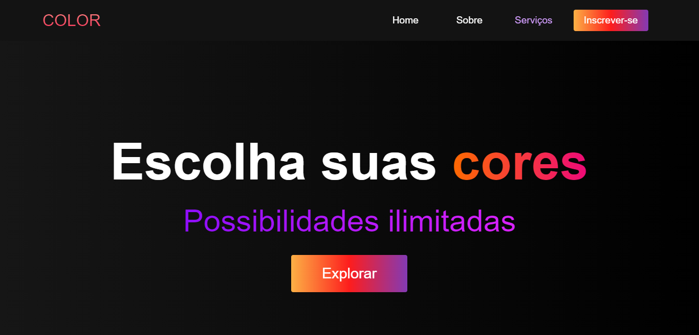

<h1 align="center">
  🎨 Color - Ianca Silva
</h1>

<h4 align="center"><a href="https://iancasilva.com.br/colorwebsite/">Clique para visitar o projeto</a></h4>

---

## 💼 Tecnologias utilizadas

Para o desenvolvimento deste site utilizei as seguintes tecnologias:

- HTML;
- CSS;
- JavaScript;
- ScrollReveal;

---

<h2>🦄 Autora</h2>

<table>
  <tr>
    <td align="center">
      <a href="https://github.com/iancaxz">
         
        
          <b>Ianca Silva</b>
        
      </a>
    </td>
  </tr>
</table>
